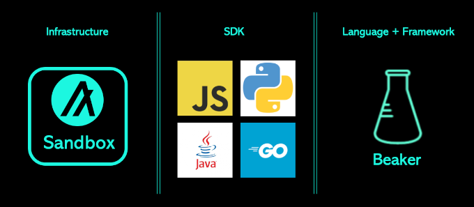

# Algorand Developer Bootcamp

## Video Recordings
- [Session #1](https://youtu.be/O7ueVpg2URc)
- [Session #2](https://youtu.be/LBjBIf_4CLQ)

## Integrated Development Environment (IDE)
[Gitpod](https://www.gitpod.io/) provides a browser-based IDE which is free to use for up to 50 hours per month (registration required).
  1. Browse to [https://gitpod.io/workspaces](https://gitpod.io/workspaces)
  2. Log in to Gitpod by clicking _Continue with GitHub_
  3. Authorize Gitpod to access your GitHub account
  4. Click _New Workspace_ 
  5. Type https://github.com/algorand-devrel/bootcamp within the _Open in Gitpod_ screen
  6. Open _README.md_ file within the IDE

## Developer Environment Components


## Developer Environment Prerequisites

- Python 3.10+ ([https://python.org](https://python.org))
- Docker Desktop 4.8.0+ ([https://docker.com](https://docker.com))
- Windows only: WSL2 ([https://learn.microsoft.com/en-us/windows/wsl/install](https://learn.microsoft.com/en-us/windows/wsl/install))

## Sandbox
Algorand Sandbox provides Algorand infrastructure running locally within your development environment. The included network(s), wallet and query tool each provide REST API endpoints to interface with your SDK and dApp.


### Install
Open a new terminal window and navigate to your desired install directory.
```
git clone https://github.com/algorand/sandbox
cd sandbox
```

### Starting a local private Algorand network

> :information_source: **Recommended**
> Most developers should begin their development process using a local private network. See later section for starting and syncing with a public Algorand network.

```
./sandbox up dev -v
```

Sandbox in _dev mode_ provides the following infrastructure components:

| Tool | Description | 
| ---- | ----------- | 
| `algod` | ledger nodes |
| `goal` | CLI tool + transaction builder |
| `kmd` | wallet (key manager) | 
| `indexer` | blockchain queries | 

> :information_source: **Notice**
> `indexer` is **not** provided when Sandbox is started on a _public_ Algorand network. User a third-party API provider in this mode.

#### Default Accounts
Sandbox running as a _local private network_ provides three (3) default accounts when the network is initialized. You may view these accounts at anytime using the following command: 
```
./sandbox goal account list
```
Sample output:
```
[online]    QYL3G7H63N3JUH6LUX3LPHWOW6AT2XYQ6GD4E3OP7KBTFKWXGTF7FW3VM4  QYL3G7H63N3JUH6LUX3LPHWOW6AT2XYQ6GD4E3OP7KBTFKWXGTF7FW3VM4  4000000000000000 microAlgos
[online]    RCJBNCQOMRBBBDG4TEVOYKUQMCFMLZ2RUWBQP3HARYBJRH5YBYRP52MFKI  RCJBNCQOMRBBBDG4TEVOYKUQMCFMLZ2RUWBQP3HARYBJRH5YBYRP52MFKI  4000000000000000 microAlgos
[online]    457AGKGZUM5QC5ESLXMGL5YD3I2A7MJDRNPYFBHKJ3PGLZMS4SQYXQBMOE  457AGKGZUM5QC5ESLXMGL5YD3I2A7MJDRNPYFBHKJ3PGLZMS4SQYXQBMOE  2000000000000000 microAlgos
```

> :information_source: **Notice**
>These pre-funded accounts are stored within the default wallet maintained by `kmd`

Set environment variables for default account addresses for CLI usage:
```
ADDR1=$(./sandbox goal account list | awk 'FNR==1{ print $2 }')
ADDR2=$(./sandbox goal account list | awk 'FNR==2{ print $2 }')
ADDR3=$(./sandbox goal account list | awk 'FNR==3{ print $2 }')
```

Display an account _Balance Record_ using:
```
./sandbox goal account dump --address $ADDR1
```

#### First Transaction
Send your first transaction using the `goal` CLI tool:

```
./sandbox goal clerk send --amount 123456789 --from $ADDR1 --to $ADDR2
./sandbox goal account dump --address $ADDR1
```

> :information_source: **Notice**
>the `--amount` flag specifies the unit of microAlgos. 1 ALGO is 1_000_000 microAlgo.

#### Query Confirmed Transactions
Use `curl` to query the Indexer for all transactions:
```
curl "localhost:8980/v2/transactions?pretty"
```

## REST APIs

### algod node
Sandbox provides `goal` as the primary CLI tool for building, signing and sending transactions. SDKs provide clients to `algod` for accessing [REST APIs](https://developer.algorand.org/docs/rest-apis/algod/v2/) using:

- Address: `http://localhost:4001` 
- Token: `aaaaaaaaaaaaaaaaaaaaaaaaaaaaaaaaaaaaaaaaaaaaaaaaaaaaaaaaaaaaaaaa`

### KMD wallet
Sandbox provides `kmd` the _key management daemon_ for storing private keys and signing transactions. SDKs provide clients for accessing [REST APIs](https://developer.algorand.org/docs/rest-apis/kmd/) using:

- Address: `http://localhost:4002` 
- Token: `aaaaaaaaaaaaaaaaaaaaaaaaaaaaaaaaaaaaaaaaaaaaaaaaaaaaaaaaaaaaaaaa`

> :information_source: **Notice**
> `goal` will automatically start `kmd` when requesting transaction signing. SDK clients must ensure `kmd` is running to successfully access the REST APIs.

### Indexer
Sandbox provides `indexer` as the primary query tool for committed blockchain data. SDKs provide clients for accessing [REST APIs](https://developer.algorand.org/docs/rest-apis/indexer/) using:

- Address: `http://localhost:8980`

> :information_source: **Notice**
> A _token_ is not required

## Syncing to Public Algorand Network(s)
Sandbox may be used to connect to the public Algorand `BetaNet` or `TestNet` or `MainNet` for deployments and limited testing. Sandbox is not supported for production infrastructure environments. Connect to `TestNet` using:
```
./sandbox up testnet -v
```
> :information_source: **Notice**
> The Indexer is not provided when Sandbox is started connected to a public network.

## SDKs
Algorand provides SDKs in four languages:
- [Python](https://developer.algorand.org/docs/sdks/python/#install-sdk)
- [JavaScript](https://developer.algorand.org/docs/sdks/python/#install-sdk)
- [Java](https://developer.algorand.org/docs/sdks/java/#install-sdk-for-runtime)
- [Go](https://developer.algorand.org/docs/sdks/python/#install-sdk)

[Algorand Community supported SDKs](https://developer.algorand.org/ecosystem-projects/?tags=sdk) are avilable in many additional languages.

### Install Python SDK
Open a new terminal window.
```
pip3 install py-algorand-sdk
```

## Account Generation

Open 1-acount_generation.py

```
from algosdk import account, mnemonic

def generate_algorand_keypair():
    private_key, address = account.generate_account()
    print("My address: {}".format(address))
    print("My private key: {}".format(private_key))
    print("My passphrase: {}".format(mnemonic.from_private_key(private_key)))

generate_algorand_keypair()
```
### Account balance

Open 2-account_balance.py

#### Create KMD client and connect to default wallet
```
# define sandbox values for kmd client
kmd_address = "http://localhost:4002"
kmd_token = "aaaaaaaaaaaaaaaaaaaaaaaaaaaaaaaaaaaaaaaaaaaaaaaaaaaaaaaaaaaaaaaa"
kmd_client = kmd.KMDClient(kmd_token, kmd_address)

# connect to default wallet
wallet = Wallet("unencrypted-default-wallet", "", kmd_client)
```

#### Create algod client
```
# define sandbox values for algod client
algod_address = "http://localhost:4001"
algod_token = "aaaaaaaaaaaaaaaaaaaaaaaaaaaaaaaaaaaaaaaaaaaaaaaaaaaaaaaaaaaaaaaa"
algod_client = algod.AlgodClient(algod_token, algod_address)
```

#### Check balance
```
# check account balance
account_info = algod_client.account_info(addr1)
print("addr1 balance: {} microAlgos".format(account_info.get('amount')) + "\n")
```

> :information_source: **Notice**
> Before sending transactions to the Algorand network, the account must be funded to cover required transaction fees. Use the [Algorand TestNet Dispenser](https://dispenser.testnet.aws.algodev.network/). ​

### Payment transaction

Open 3-payment_transaction.py

#### build unsigned transaction
```
params = algod_client.suggested_params()
receiver = addr2
note = "Hello World".encode()
amount = 1000000
unsigned_txn = transaction.PaymentTxn(addr1, params, receiver, amount, None, note)
```

#### sign transaction
```
signed_txn = unsigned_txn.sign(wallet.export_key(addr1))
```

#### submit transaction
```
txid = algod_client.send_transaction(signed_txn)
print("Successfully sent transaction with txID: {}".format(txid))
```

## Account Info
Open 4-account_info.py

## Asset Creation (ASA)
Open 5-create_asset.py

```
unsigned_txn = AssetConfigTxn(sender=addr1,
        sp=params,
        total=10000,   # Fungible tokens have total issuance greater than 1
        decimals=2,    # Fungible tokens typically have decimals greater than 0
        default_frozen=False,
        unit_name="FUNTOK",
        asset_name="Fun Token",
        manager=addr1,
        strict_empty_address_check=False,
        reserve="",
        freeze="",
        clawback="",
        url="https://path/to/my/fungible/asset/metadata.json",
        metadata_hash="", # Typically include hash of metadata.json (bytes) 
)
```
### Asset Optin
By default the creator account is optin to hold the asset, all other accounts must make an asset optin transaction for each asset they desire to hold.

Open 6-assest_optin.py

```
# build unsigned transaction
params = algod_client.suggested_params()
sender = addr2
index = 2   # ensure this matches the asset-index returned by asset_create.py 
unsigned_txn = transaction.AssetOptInTxn(sender, params, index)
```

## Atomic Transactions
Atomic transactions enforce execution of a defined set of ordered transations will either all succeed, else no state transitions will persist upon failure of any transaction therein. Typically used in asset swaps and smart contract calls.

### Swap ALGO for FUNTOK
Open 7-atomic_transaction.py

#### build unsigned payment transaction

```
params = algod_client.suggested_params()
sender = addr2
receiver = addr1
amount = 1000000
txn_1 = transaction.PaymentTxn(sender, params, receiver, amount)
```

#### build unsigned asset transfer transaction
```
sender = addr1
receiver = addr2
amount = 100 # remember this ASA has 2 decimal places, so this is 1.00 FUNTOK 
index = 2   # ensure this matches the asset-index returned by asset_create.py 
txn_2 = transaction.AssetTransferTxn(sender, params, receiver, amount, index)
```

##### group transactions
```
gid = transaction.calculate_group_id([txn_1, txn_2])
txn_1.group = gid
txn_2.group = gid
```

#### sign transaction
```
stxn_1 = txn_1.sign(wallet.export_key(addr2))    
stxn_2 = txn_2.sign(wallet.export_key(addr1))
```

#### assemble transaction group
```
signed_group = [stxn_1, stxn_2]
```

#### submit atomic transaction group
```
txid = algod_client.send_transactions(signed_group)
```


